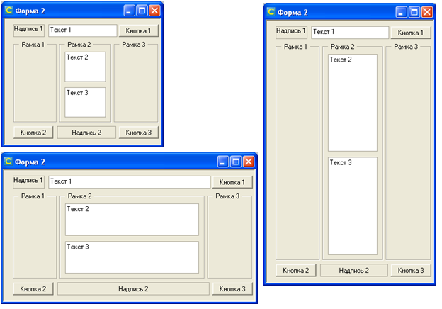
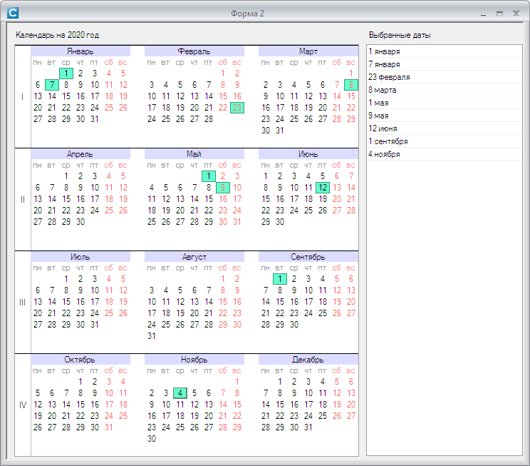
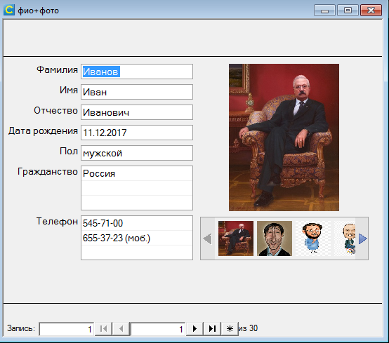

# FormComponents
Модули ИСУБД CronosPro, реализующие различные элементы форм ввода.

## TCheckButton
Кнопка-переключатель с двумя состояниями. Представляет собой панель с размещенной внутри картинкой. 
При щелчке меняет свое состояние «нажато/отжато». 
Может использоваться вместо переключателя. Состояние кнопки определяется свойством Check.

## TFormAlign
Модуль для реализации "резинового макета" на формах ввода ИСУБД CronosPro.
Обеспечивает изменение размеров и положения элементов формы в зависимости от размеров окна.  
  

## TMonthCalendar
Элемент для выбора даты из календаря.

## TYearCalendar
Элемент для выбора даты (нескольких дат) из календаря.

## TScrollPanel
Панель с возможностью прокрутки содержимого в горизонтальном или вертикальном направлении.

