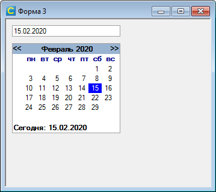

# FormComponents
Набор модулей ИСУБД CronosPro, реализующих различные элементы форм ввода.

## [TCheckButton](TCheckButton)
Кнопка-переключатель с двумя состояниями. Представляет собой панель с размещенной внутри картинкой. 
При щелчке меняет свое состояние «нажато/отжато». 
Может использоваться вместо переключателя. Состояние кнопки определяется свойством Check.

[Перейти в папку модуля](TCheckButton)

## [TFormAlign](TFormAlign)
Модуль для реализации "резинового макета" на формах ввода ИСУБД CronosPro.
Обеспечивает изменение размеров и положения элементов формы в зависимости от размеров окна.  
  

[Перейти в папку модуля](TFormAlign)

## [TMonthCalendar](TMonthCalendar)
Элемент для выбора даты из календаря.

[Перейти в папку модуля](TMonthCalendar)

## [TYearCalendar](TYearCalendar)
Элемент для выбора даты (нескольких дат) из календаря.

[Перейти в папку модуля](TYearCalendar)

## [TScrollPanel](TScrollPanel)
Панель с возможностью прокрутки содержимого в горизонтальном или вертикальном направлении.

[Перейти в папку модуля](TScrollPanel)
