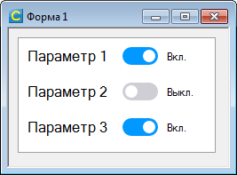
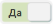
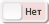
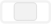

# TCheckButton
Кнопка-переключатель с двумя состояниями. Представляет собой панель с размещенной внутри картинкой. 
При щелчке меняет свое состояние «нажато/отжато». Элемент может использоваться вместо стандартного переключателя. Состояние кнопки определяется свойством Check.



## Свойства
*bool* **Check** -  
состояние кнопки

*bool* **Enabled** -  
доступность кнопки

*string* **ActiveIcon** -  
изображение нажатой кнопки в кодировке Base64

*string* **InactiveIcon** -   
изображение отжатой кнопки в кодировке Base64

*string* **LockedIcon** -  
изображение недоступной кнопки в кодировке Base64

*string* **ButtonType** -  
тип кнопки - определяет набор изображений для нажатой/отжатой/недоступной кнопки.  
Тип задается константой:

<table>
<tr><td>имя</td><td>размер</td><td>Нажато</td><td>Отжато</td><td>Недоступно</td></tr>
<tr><td>Default</td><td>16x16</td><td></td><td></td><td></td></tr> 
<tr><td>Switch</td><td>40x20</td><td></td><td></td><td></td></tr> 
<tr><td>YesNo</td><td>49x24</td><td></td><td></td><td></td></tr> 
<tr><td>Button</td><td>32x32</td><td></td><td></td><td></td></tr> 
</table>

*number* **X**, **Y** -  
положение кнопки на панели

*number* **Width**, **Height** -    
ширина и высота кнопки


## Методы
_TCheckButton_ **new**  
конструктор  

new(*Panel* site, *string* type )   
new(*Panel* site, *table* icons )  
new(*Panel* site, *string* icon1,  *string* icon2,  *string* icon3 ) 

site - панель, на которой располагается кнопка

type - тип кнопки

icon1 - пиктограмма нажатой кнопки. Содержимое графического файла в кодировке Base64

icon2 - пиктограмма отжатой кнопки. Содержимое графического файла в кодировке Base64

icon3 - пиктограмма недоступной кнопки. Содержимое графического файла в кодировке Base64

icons - таблица пикторграмм дл кнопки. Должна содержать три строки (содержимое графического файла в кодировке Base64), соответствующих состояниям "нажато", "отжато" и "недоступно"

## События ##

**OnCheckStateChanged**  
Обработчик события CheckStateChanged, которое происходит при изменении состояния кнопки. 

  OnCheckStateChanged(*TCheckButton* control)  

сontrol - объект TCheckButton, для которого было сгенерировано событие.

**OnClick**   
Обработчик события Click, которое происходит при одинарном щелчке на элементе левой клавишей мыши. 

  OnClick(*TCheckButton* control)   

сontrol - объект TCheckButton, для которого было сгенерировано событие.


## Пример использования
``` lua
local TCheckButton = require("TCheckButton")

function Форма_Load( form )
  checker = TCheckButton(Me.panel1,"Switch")
  checker.OnCheckStateChanged = function(self)
  if self.Check then
    Me.textbox2.Text = "Вкл."   
  else
    Me.textbox2.Text = "Выкл."
  end	
end
```
