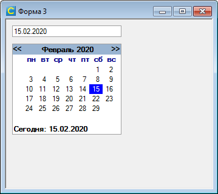

# TMonthCalendar
Элемент для выбора даты из календаря.



## Свойства
*number* Day -  
номер дня выбранной даты (1-31). Режим доступа - чтение.

*number* Month -  
номер месяца выбранной даты (1-12). Режим доступа - чтение.

*number* Year -  
номер года выбранной даты (1900 - 2999). Режим доступа - чтение.

## Методы
**Show**(*TMonthCalendar* sender) -  
отбразить календарь 

**Hide**(*TMonthCalendar* sender) -  
скрыть календарь

**SetDate**(*TMonthCalendar* sender, *string* date)  -  
**SetDate**(*TMonthCalendar* sender, *table* date)  -  
**SetDate**(*TMonthCalendar* sender, *number* day, *number* month, *number* year)  -  
установить дату  
 - *string* date - строковое представление даты в формате ДД.ММ.ГГГГ. Пример: *calendar:SetDate("01.01.2002")*
 - *table* date - таблица {день,месяц.год}. Пример: *calendar:SetDate({1,1,2002})*
 - *number* day, *number* month, *number* year - значения дня, месяца и года. Пример: *calendar:SetDate(1,1,2002)*

## События
**OnDateSelect**(*TMonthCalendar* sender, *number* day, *number* month, *number* year) -  
событие происходит при выборе пользователем даты в календаре

## Пример использования
```lua
local TMonthCalendar = require "TMonthCalendar"

function Форма_Load( form )
	Calendar = TMonthCalendar(Me.panel1)
	Calendar.OnDateSelect = function(sender, day, month, year)
		Me.textbox1.Text = ("%02d.%02d.%d"):format(day,month,year)
	end
end
```
