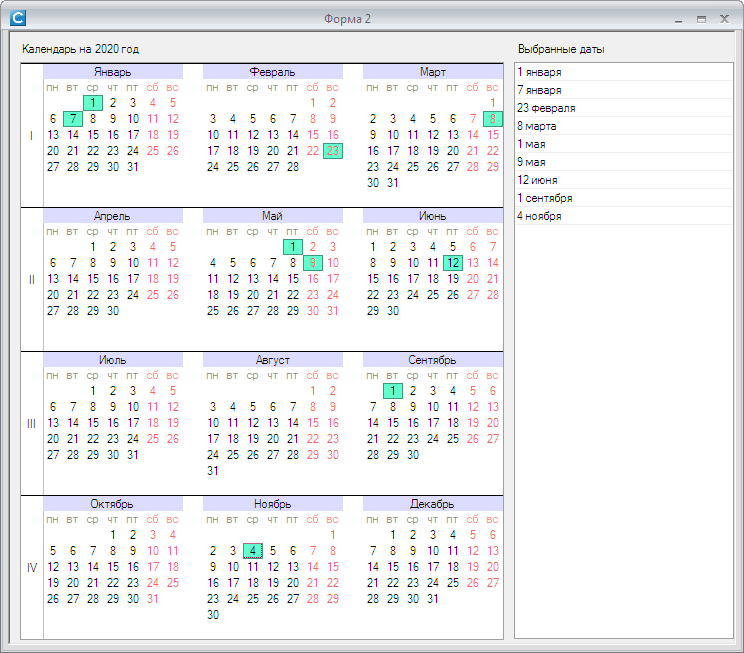

# TYearCalendar



## Свойства
*number* **Year** -  
отображаемый год. Режим доступа - чтение/запись.

*Color* **CheckedBackColor** -  
цвет выделенной даты. Режим доступа - чтение/запись.

*table* **CheckedDates** -  
список выделенных дат. Режим доступа - чтение.  
Значением является массив таблиц вида  
{ *number* Day = <номер дня>, *number* Month = <номер месяца>, *number* Year = <номер года> }  

## Методы
*bool* **IsDateChecked**(*TYearCalendar* sender, *number* day, *number* month, *number* year) -   
проверить отмечена ли дата  
- *number* day, *number* month, *number* year - значения дня, месяца и года  
`local ok = calendar:IsDateChecked(2,5,2020)`

**SetDateChecked**(*TYearCalendar* sender,*number* day,*number* month[,*number* year[,*bool* mode]]) -  
отметить дату или снять отметку  
- day, month, year - значения дня, месяца и года, если год не указан - используется текущий отображаемый в календаре год  	
- mode - режим (**true** - отметить дату, **false** - снять отметку, по умолчанию - **true** )  
`calendar:SetDateChecked(2,5,2020)`

*table* **GetChecked**(*TYearCalendar* sender, *bool* asText) -  
получить список выделенных дат.
- asText - способ представления дат:  
**true** - в виде текстовой строки ("2 мая 2020 г."),  
**false** - в формате ДД.ММ.ГГГГ ("02.05.2020")  

## События
**OnDateClick**(*TYearCalendar* Sender,*number* day,*number* month) -  
событие возникает при щелчке мышью по дате  
- day, month - номера дня и месяца выбранной даты

**OnDateDblClick**(*TYearCalendar* Sender,*number* day,*number* month) -  
событие возникает при двойном щелчке по дате
- day, month - номера дня и месяца выбранной даты

## Пример использования
``` lua
local TYearCalendar = require "TYearCalendar"

function Форма_Load( form )
	local calendar = TYearCalendar(Me.panel1)
	calendar.OnDateClick = function(sender,day,month)
		sender:SetDateChecked(day,month,calendar.Year,not(sender:IsDateChecked(day,month)))
		local dates = sender:GetChecked(true)
		Me.listbox1:Clear()
		for i=1,#dates do
			Me.listbox1:Add(dates[i])
		end
	end
end
```
## См. также
- [демо форма](DemoFormCopy.cfc)

